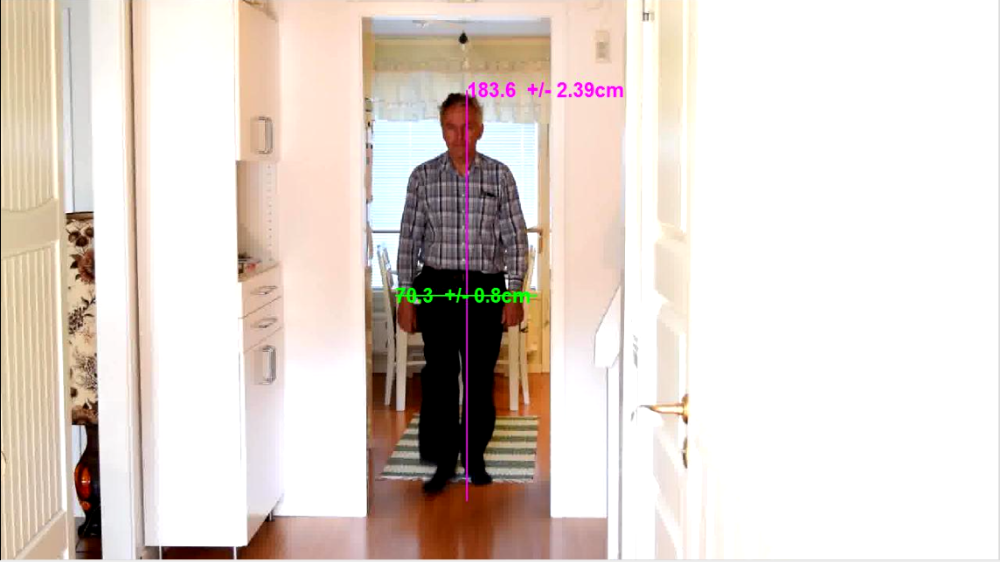

# Human Height Estimator

This is a computer vision based height estimator from a single image. It uses epipolar lines and vanishing point in order to estimate an accurate height of humans in the scene.

## Requirements

* Matlab
* OpenCV